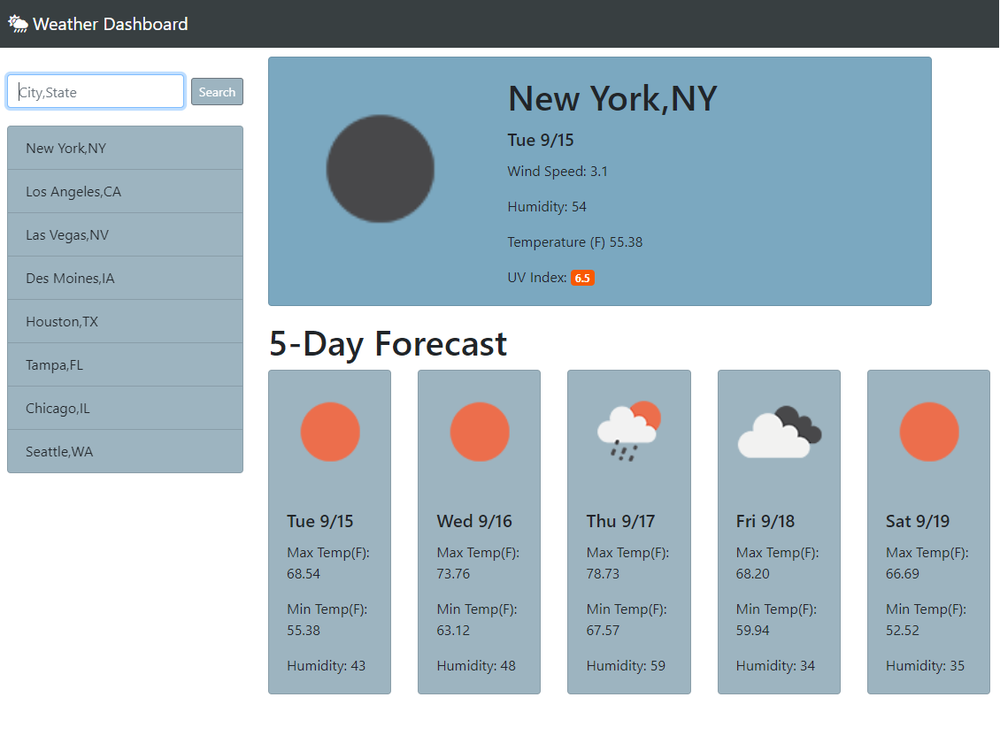

# Weather Dashboard
Weather dashboard with 5 day forecast 

Link:https://korynelson.github.io/weatherDashboard/

This webiste uses 2 third-party APIs to generate weather for any searched city.
It then outputs this data for Current weather and 5 Day forecast.  
Other features include dynamically updated html, saved location searches.

API's used:
https://openweathermap.org/api
https://opencagedata.com/api


## User Story

```
AS A traveler
I WANT to see the weather outlook for multiple cities
SO THAT I can plan a trip accordingly
```


